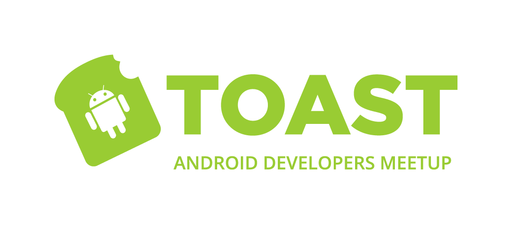
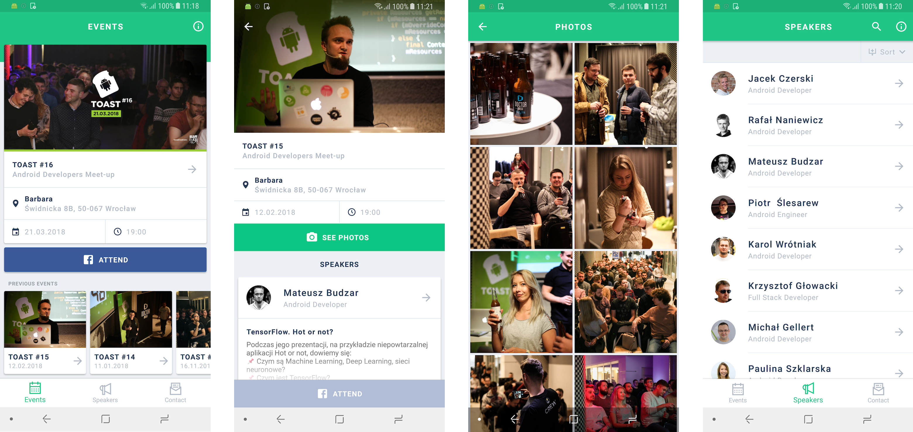

#
| Branch	| Build Status	| Unit tests coverage	|
|---	|:---:	|:---:	|
| Master   	| [](https://www.bitrise.io/app/ba74361b1a7a3cbf)  	| [](https://codecov.io/gh/DroidsOnRoids/Toast-App) 	|
| Develop  	| [](https://www.bitrise.io/app/ba74361b1a7a3cbf)  	|  [](https://codecov.io/gh/DroidsOnRoids/Toast-App) 	|

Toast App is supporting Android developers meetup in Poland - Toast, which takes place in Wrocław.

This app allows you to keep up to date with the latest events info like speakers descriptions, lectures topics or previous events photo galleries. Additionally, user may contact us via contact form.



## Features
- [x] Events and lectures info
- [x] Event photo gallery
- [x] Speakers list and details
- [x] Contact form
- [x] Notifications about new content

## Communication
* If you **found a bug** or have a **feature request** - open an issue.
* If you want to **contribute** - submit a pull request.

## Requirements
* Android 5.0+
* Android Studio 3+
* Kotlin 1.2.30

## Installation guide
- Download repo
    ```
    $ git clone https://github.com/DroidsOnRoids/Toast-App.git
    ```
- Run the app

## Project info

The app is using the [MVVM architecture](https://en.wikipedia.org/wiki/Model–view–viewmodel) with [Android Architecture Components](https://developer.android.com/topic/libraries/architecture/index.html) and [databinding](https://developer.android.com/topic/libraries/data-binding/index.html)

#### Firebase Cloud Messaging

There are 3 topics for notifications: new event, new photos, new talk.

Notification template for a new event:
```
{
  "message": {
    "android": {
      "data": {
        "event_id": "EVENT_ID"
      },
      "notification": {
        "click_action": "pl.droidsonroids.toast.event",
        "title_loc_key": "new_event_title",
        "body_loc_key": "new_event_description",
        "body_loc_args": ["EVENT_TITLE"]
      }
    },
    "topic": "new_event"
  }
}
```

Notification template for a new photos:
```
{
  "message": {
    "android": {
      "data": {
        "event_id": "EVENT_ID"
      },
      "notification": {
        "click_action": "pl.droidsonroids.toast.event",
        "title_loc_key": "new_photos_title",
        "body_loc_key": "new_photos_description",
        "body_loc_args": ["EVENT_TITLE"]
      }
    },
    "topic": "new_photos"
  }
}
```

Notification template for a new talk:
```
{
  "message": {
    "android": {
      "data": {
        "event_id": "EVENT_ID"
      },
      "notification": {
        "click_action": "pl.droidsonroids.toast.event",
        "title_loc_key": "new_talk_title",
        "title_loc_args": ["EVENT_TITLE"],
        "body_loc_key": "new_talk_description",
        "body_loc_args": ["AUTHOR_NAME", "TALK_TITLE"]
      }
    },
    "topic": "new_talk"
  }
}
```

#### Remote config

The app is using remote config for API URL changes.
There are two keys for each flavor. I.e. for toast flavor: `toastBaseUrl` and `toastImageUrl`.
Value cache time is set to 1 day. Keep it in mind when you're changing config from Firebase console.

#### Mocking server responses sample in UI test using MockWebServer path dispatcher -> [HERE](app/src/androidTest/SAMPLE.md)

## License
Toast App is licensed under Apache License 2.0. [See LICENSE](https://github.com/DroidsOnRoids/toast-app/blob/master/LICENSE) for details.

## About us


Toast App is maintained by Droids On Roids. For more details visit our [website](https://www.thedroidsonroids.com/).

Check out our other [open source projects](https://github.com/DroidsOnRoids) and [our blog](https://www.thedroidsonroids.com/blog).